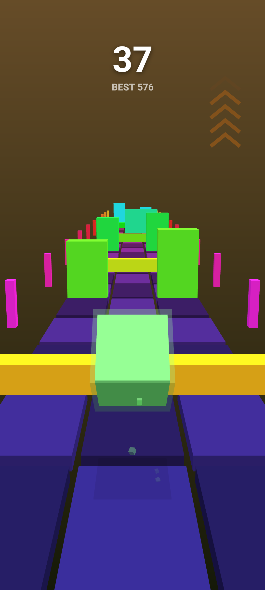
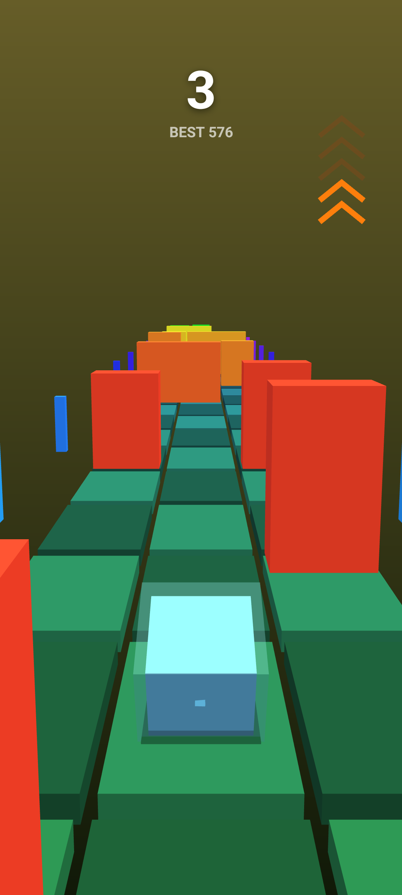
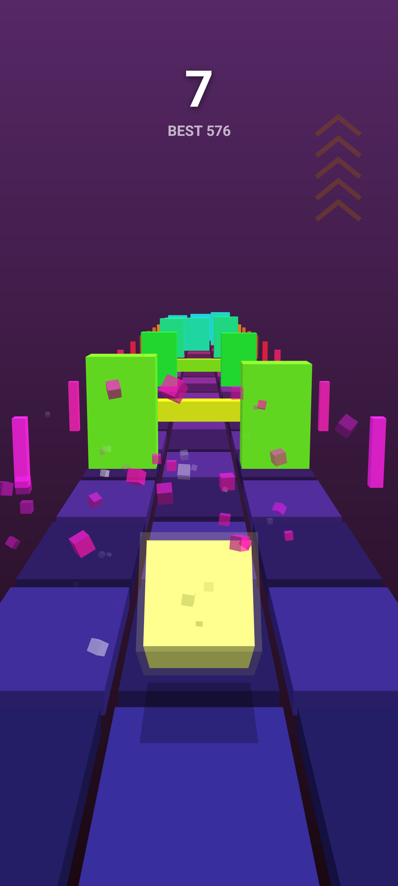
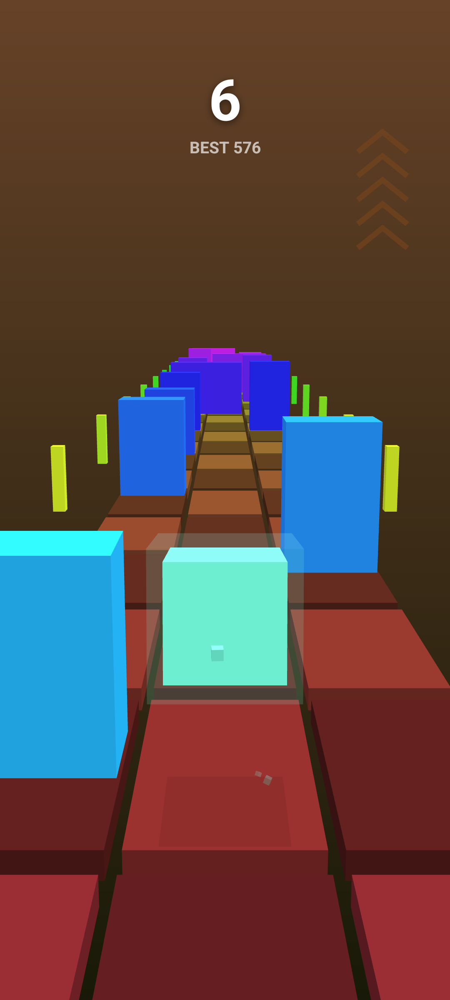

# Cube Run

A minimalist one-thumb 3D runner: swipe to dodge, jump and slam your cube
through an endless neon gauntlet rushing toward you.

Latest APK: [GitHub releases](https://github.com/Eve-146T/cube-run/releases/latest).

## Screenshots

<p align="center">
  
  
  
  
</p>

## Gameplay

- Swipe **left / right** to snap between the three lanes.
- Swipe **up** to jump low walls. Swipe **down** to roll under overhead bars
  on the ground, or to slam back down fast when you're mid-air.
- Pillars and wide bars leave exactly one safe lane, and some obstacles slide
  into the open lane as they approach — read the track and commit late.
- The track is stitched from hand-made sections (weaves, hurdles, limbo runs,
  slaloms, skill-checks) that recur and recombine between runs, with a rest
  beat woven in. Tougher sections unlock the longer you survive.
- Score one point per row cleared, plus a bonus for shaving past an obstacle.
  The pace eases up to a steady cruising speed and then holds there — runs end
  on focus, not on impossible reflexes. Your best score is saved locally.

No accounts, no ads, no tracking, no network access.

## Building

Requires a JDK (17+) and the Android SDK (platform 35, build-tools 35.0.0).

```bash
export ANDROID_HOME=/path/to/android-sdk
./gradlew assembleDebug
# -> app/build/outputs/apk/debug/app-debug.apk
```

A signed release APK is produced by CI on every `v*` tag and attached to a
GitHub release; see [`.github/workflows/build.yml`](.github/workflows/build.yml).
The libGDX native libraries are extracted from the `gdx-platform` artifacts at
build time, so they are not checked in.

## License

Cube Run is free software, licensed under the
[GNU General Public License v3.0](LICENSE). Built with [libGDX](https://libgdx.com/).
