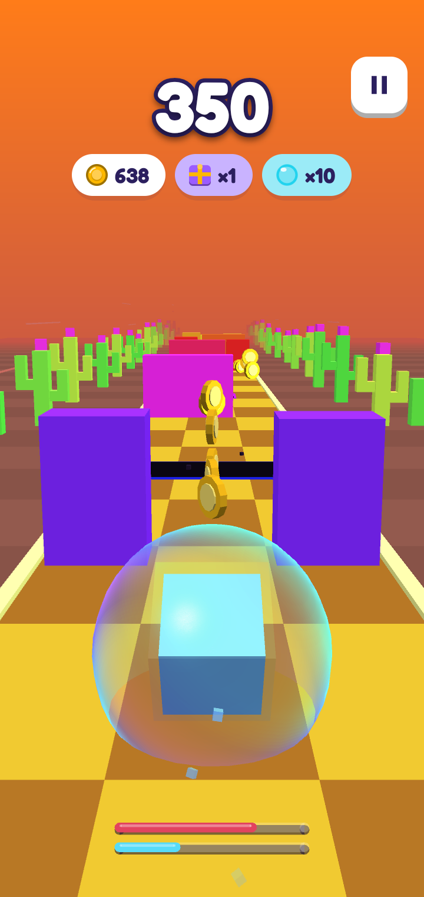
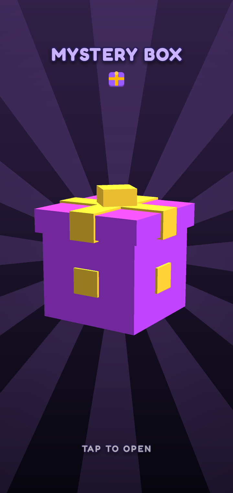
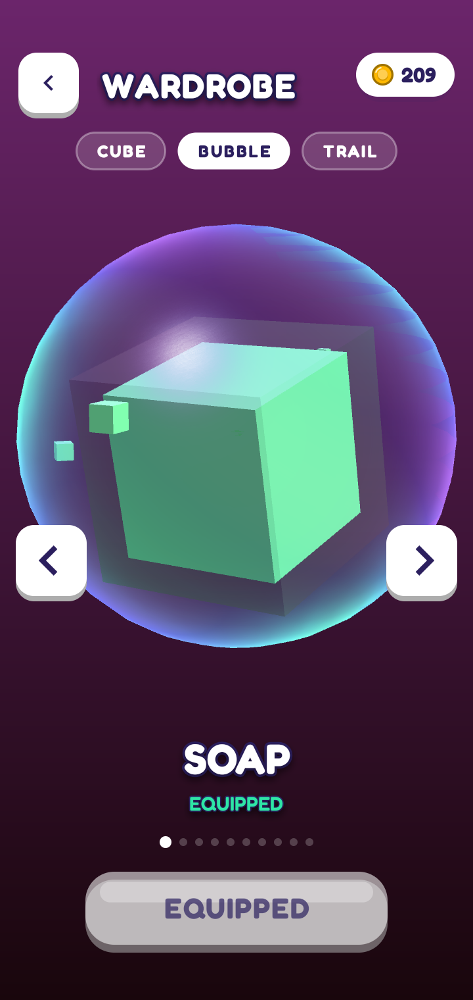
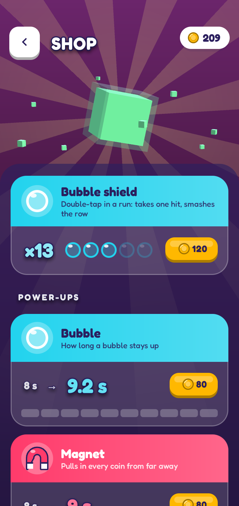

# Cube Run

Endless runner but you are cube.

> [!TIP]
> Vibe coded pull requests welcome! 
    
Latest APK: [GitHub releases](https://github.com/Eve-146T/cube-run/releases/latest).

## Screenshots

  
  
  
  

  
  
  
  

## Gameplay

- Swipe to control your character
- Physical controls: arrow keys, WASD, controller D-pad or left stick to move,
  jump (up) and duck (down). Enter, Space, D-pad center or controller A performs
  a tap (start a run; double-press for a shield). Directions select menu controls;
  the same confirm key activates them and advances results and mystery boxes.
- P or controller Start pauses/resumes; Escape or controller B goes back/pauses.
  B on the keyboard or controller X uses headstart while its button is visible.
- You have to jump over some obstacles and slide under others.
- If you're a pro gamer you can press the headstart icon up to 5 times to start faster

## License

Cube Run is free software, licensed under the
[GNU General Public License v3.0](LICENSE). Built with [libGDX](https://libgdx.com/).
