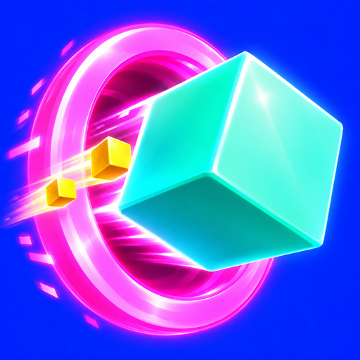
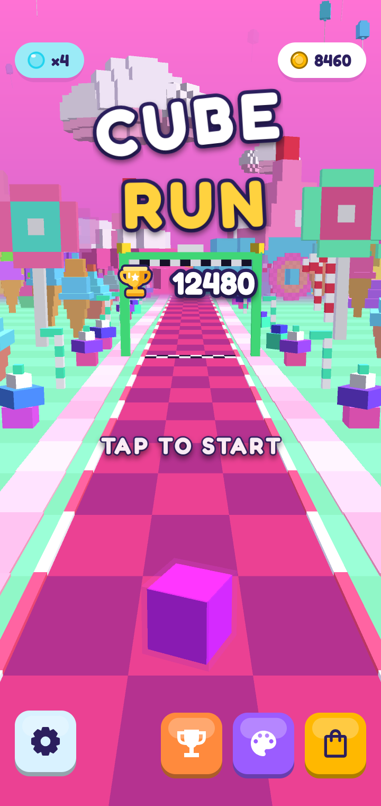
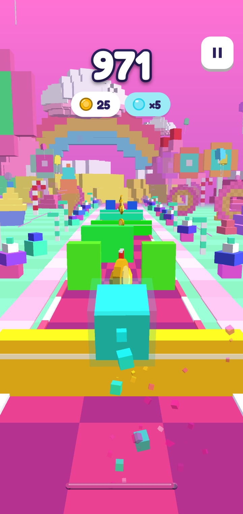
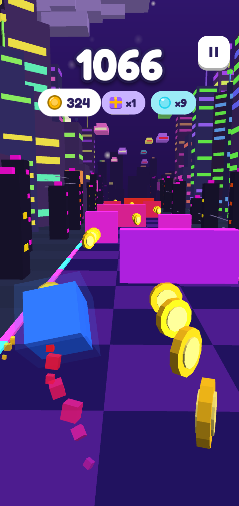
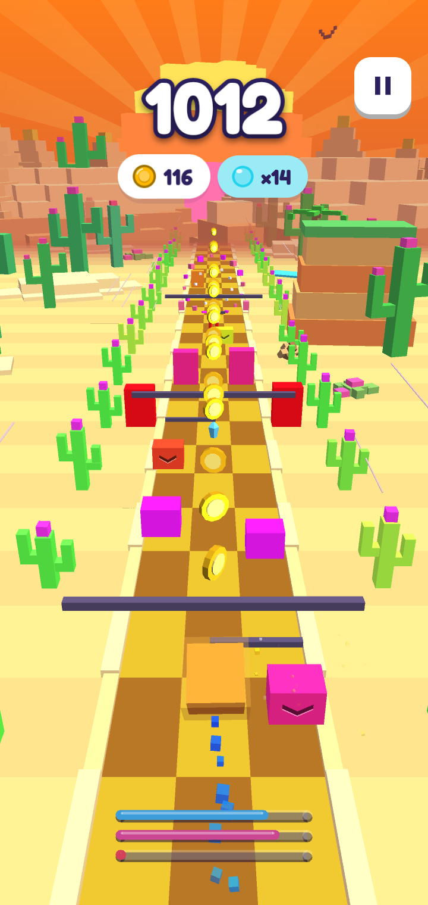
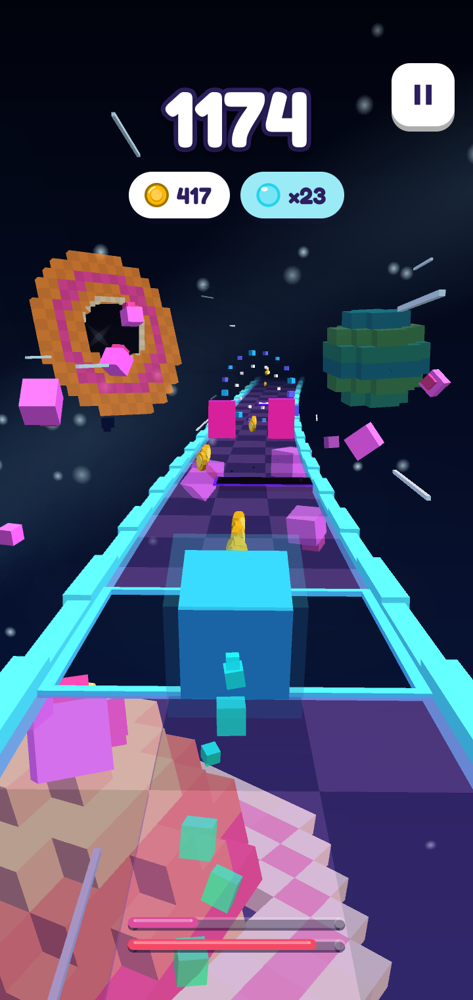
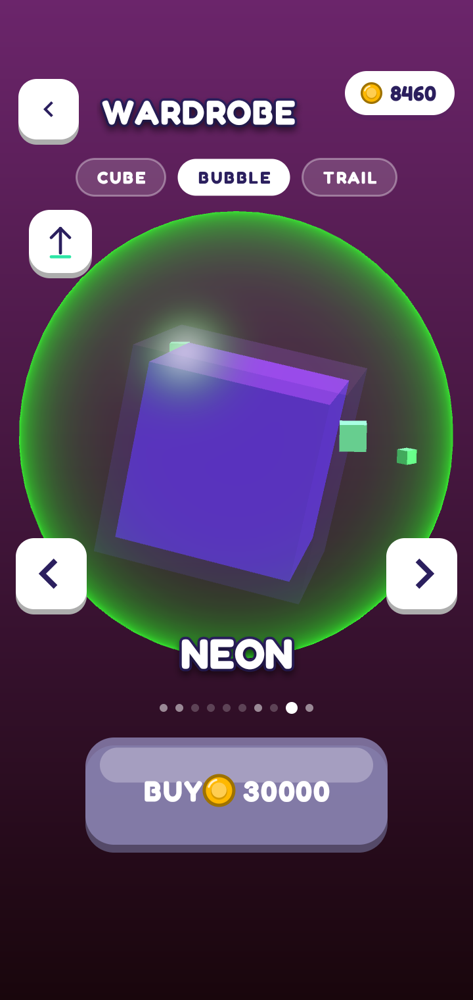
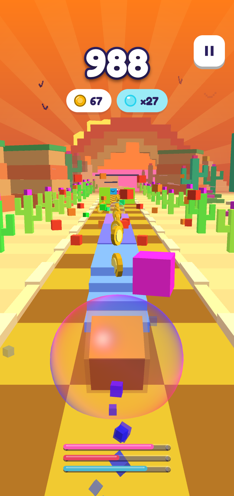
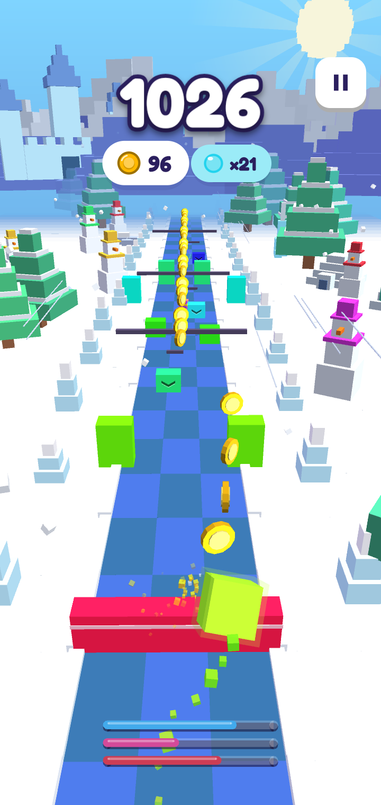

# Cube Run

Endless runner but you are cube.

> [!TIP]
> Vibe coded pull requests welcome! 
    
Latest APK: [GitHub releases](https://github.com/Eve-146T/cube-run/releases/latest).

## Screenshots

  
  
  
  

  
  
  
  

## Gameplay

- Swipe to control your character
- You have to jump over some obstacles and slide under others.
- If you're a pro gamer you can press the headstart icon up to 5 times to start faster

## License

Cube Run is free software, licensed under the
[GNU General Public License v3.0](LICENSE). Built with [libGDX](https://libgdx.com/).
